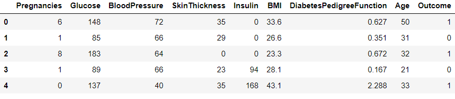

# ⚕️ Diabetes Classifier ⚕️
Predicting whether a patient is prone to diabetes or not using Machine Learning.

## Data:

* Dataset used is Pima Indians Diabetes Dataset, obtained from Kaggle.

* The datasets consists of several medical predictor variables and one target variable, Outcome. 
* Predictor variables includes the number of pregnancies the patient has had, their BMI, insulin level, age, and so on.

For further information, please refer the [Pima Indian Diabetes Dataset](https://www.kaggle.com/uciml/pima-indians-diabetes-database).

## Models:

The models included are:
* Tuned and Baseline [Logistic Regression](https://scikit-learn.org/stable/modules/generated/sklearn.linear_model.LogisticRegression.html).
* Tuned and Baseline [Random Forest Classifier](https://scikit-learn.org/stable/modules/generated/sklearn.ensemble.RandomForestClassifier.html).

## How to use:

To use the model, download and run `main.py`. The model used by default is Tuned Logistic Regression.

